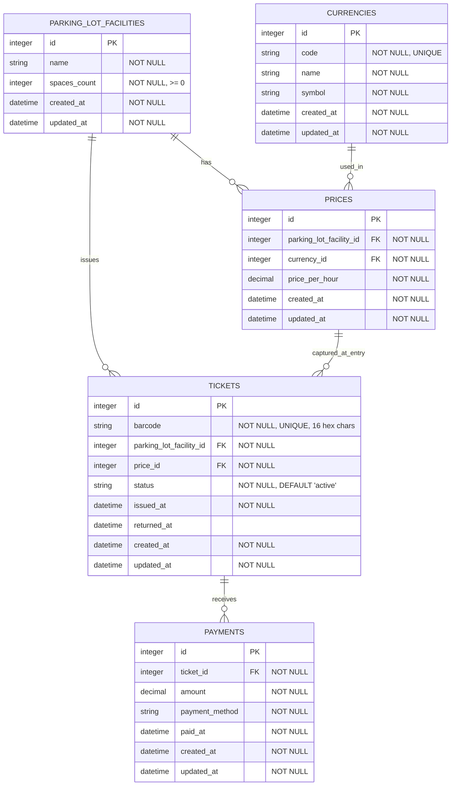

# Database Schema

## Entity Relationship Diagram

## Table Descriptions

### parking_lot_facilities
Represents a physical parking lot location.

**Key Fields:**
- `spaces_count`: Total number of parking spaces available
- **Constraint**: `spaces_count >= 0`

### currencies
Supported currencies for pricing.

**Key Fields:**
- `code`: ISO currency code (e.g., "EUR", "USD")
- `symbol`: Currency symbol (e.g., "€", "$")
- **Constraint**: Unique currency code

### prices
Pricing configuration for parking lots. Allows price changes over time while maintaining historical accuracy.

**Key Fields:**
- `price_per_hour`: Cost per started hour
- **Relationships**:
  - Belongs to a parking lot facility
  - Uses a specific currency

### tickets
Parking tickets issued when vehicles enter.

**Key Fields:**
- `barcode`: 16-character hex identifier (e.g., "a1b2c3d4e5f67890")
- `status`: Either "active" or "returned"
- `price_id`: Captures the price configuration at entry time (historical accuracy)
- `issued_at`: When the ticket was created
- `returned_at`: When the ticket was returned (null if not returned)

**Constraints:**
- Unique barcode
- Status defaults to "active"

**Business Logic:**
- Only "active" tickets count toward parking capacity
- Tickets become "returned" when the vehicle exits

### payments
Payment records for tickets. Multiple payments allowed per ticket (e.g., if payment expires).

**Key Fields:**
- `amount`: Amount paid (captured at payment time)
- `payment_method`: One of: `credit_card`, `debit_card`, `cash`
- `paid_at`: Timestamp of payment

**Business Logic:**
- Latest payment determines ticket's paid status
- Payment valid for 15 minutes after `paid_at`
- Multiple payments per ticket are allowed

## Relationships

### One-to-Many
- **ParkingLotFacility → Tickets**: One parking lot issues many tickets
- **ParkingLotFacility → Prices**: One parking lot can have multiple price configurations over time
- **Currency → Prices**: One currency used in many price configurations
- **Price → Tickets**: One price configuration captured by many tickets (at their entry time)
- **Ticket → Payments**: One ticket can receive multiple payments

## Indexes

- `currencies.code` - Unique index for fast currency lookup
- `tickets.barcode` - Unique index for ticket identification
- `tickets.parking_lot_facility_id` - Foreign key index
- `tickets.price_id` - Foreign key index
- `prices.parking_lot_facility_id` - Foreign key index
- `prices.currency_id` - Foreign key index
- `payments.ticket_id` - Foreign key index

## Key Design Decisions

1. **Price History**: Tickets reference the `Price` at entry time rather than storing price directly. This maintains historical accuracy if prices change.

2. **Multiple Payments**: The schema allows multiple payments per ticket to handle the 15-minute expiration window. If a customer pays but takes longer than 15 minutes to exit, they can pay again.

3. **Ticket Status**: Using an enum-like status field (`active`/`returned`) instead of a boolean allows for future expansion (e.g., `cancelled`, `expired`).

4. **Denormalized Payment Methods**: Payment methods stored as strings with validation rather than a separate table, prioritizing simplicity over normalization.

5. **Soft Lifecycle**: Tickets are never deleted, only marked as `returned`. This maintains a complete audit trail.